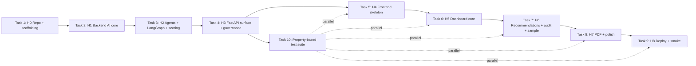

# Implementation Plan: ContractForge Auditor

## Overview

Convert the feature design into a series of prompts for a code-generation LLM that will implement each step with incremental progress. Make sure that each prompt builds on the previous prompts, and ends with wiring things together. There should be no hanging or orphaned code that isn't integrated into a previous step. Focus ONLY on tasks that involve writing, modifying, or testing code.

This plan mirrors the 8-hour spine in design.md §15. Each parent task corresponds to one hour block (H0–H8). Backend is Python (FastAPI + LangGraph + Google Gemini), frontend is TypeScript (React 18 + Vite + Tailwind + shadcn/ui + Zustand). All file paths follow the folder structure in design.md §Architecture. A dedicated property-based test suite (Task 10) runs in parallel from H3 onward.

## Tasks

- [x] 1. H0 — Repo + scaffolding
  - [x] 1.1 Initialise the backend Python project at `backend/` (`pyproject.toml` or `requirements.txt`) with dependencies `fastapi`, `uvicorn`, `pydantic>=2`, `langgraph`, `google-generativeai`, `pdfplumber`, `weasyprint`, `matplotlib`, `jinja2`, `python-multipart`, `pytest`, `hypothesis`; create the empty package tree `backend/app/{api,agents,services,models}/__init__.py` matching design §Architecture.
  - [x] 1.2 Scaffold the frontend at `frontend/` with `npm create vite@latest -- --template react-ts`, install `tailwindcss`, `postcss`, `autoprefixer`, `zustand`, `clsx`, `tailwind-merge`; run `npx shadcn-ui@latest init` and create `frontend/src/{routes,components,store,api,lib,styles}/.gitkeep`.
  - [x] 1.3 Create `backend/.env.example` listing `GOOGLE_API_KEY`, `FRONTEND_ORIGIN`, `GEMINI_MODEL`; create `frontend/.env.example` with `VITE_API_BASE_URL`.
  - [x] 1.4 Create `frontend/vercel.json` shell with rewrites and a build command, and stub `backend/Dockerfile` and `backend/render.yaml` (or `backend/fly.toml`) placeholder files for later H8 wiring.
  - [x] 1.5 Add a root `README.md` describing the two-folder layout and a `.gitignore` covering `node_modules`, `.venv`, `__pycache__`, `dist`, `.env`.
  - _Validates: Requirements 10.1, 10.2, 10.3, 10.7_

- [x] 2. H1 — Backend AI core (prompts, schemas, Gemini client, first two agents)
  - [x] 2.1 Create `backend/app/agents/prompts.py` exporting the `GUARDRAIL` constant verbatim from design §Agent System Prompts plus `INGESTION_PROMPT` and `CLAUSE_ANALYSIS_PROMPT` templates that prepend `GUARDRAIL`.
  - [x] 2.2 Create `backend/app/agents/schemas.py` with the Pydantic v2 models `CharSpan`, `Clause`, `ClauseList`, `ClauseAnalysis`, `ClauseAnalysisList` and the `Language` / `ClauseType` literal types from design §Pydantic Output Schemas.
  - [x] 2.3 Create `backend/app/agents/gemini_client.py` implementing `invoke(prompt, response_model, agent_name, job_id)` that calls Gemini with `response_mime_type="application/json"` + `response_schema`, validates the response against `response_model`, runs exactly one repair retry on validation failure, hashes input/output with SHA-256, measures latency, and writes an `AuditEntry` via `services.audit_log` (use a thin shim if `audit_log` is not yet implemented).
  - [x] 2.4 Create `backend/app/agents/state.py` with the `PipelineState` `TypedDict` from design §LangGraph State & Wiring.
  - [x] 2.5 Create `backend/app/agents/ingestion.py` exporting `run(state)` that calls `gemini_client.invoke` with Gemini native PDF understanding for the contract bytes, falls back to a `pdf_parser.extract_text` shim on empty/error, attaches `language` to each `Clause`, and returns `{clauses, language}`.
  - [x] 2.6 Create `backend/app/agents/clause_analysis.py` exporting `run(state)` that emits one `ClauseAnalysis` per input clause in order, with `summary` and `key_terms` in the contract `language`.
  - [x]* 2.7 Add `backend/tests/test_ingestion_smoke.py` exercising `ingestion.run` against a tiny EN string and a tiny VI string with the Gemini client mocked to return canned JSON.
  - _Validates: Requirements 1.6, 1.7, 1.8, 1.9, 2.3, 6.1, 6.2, 6.4, 9.1, 9.2, 9.3_

- [x] 3. H2 — Remaining agents, LangGraph wiring, deterministic scoring
  - [x] 3.1 Extend `backend/app/agents/prompts.py` with `POLICY_MAPPING_PROMPT`, `RISK_SIMULATION_PROMPT`, `RECOMMENDATION_PROMPT`, `REPORT_PROMPT`, each prepending `GUARDRAIL` and using the bodies in design §Agent System Prompts.
  - [x] 3.2 Extend `backend/app/agents/schemas.py` with `Violation`, `ViolationList`, `SimulationResult`, `SimulationResultList`, `Recommendation`, `RecommendationList`, `PerCategoryScores`, and `GovernanceReport` from design §Pydantic Output Schemas.
  - [x] 3.3 Implement `backend/app/agents/policy_mapping.py`, `backend/app/agents/risk_simulation.py`, `backend/app/agents/recommendation.py`, and `backend/app/agents/report.py`, each exporting `run(state)` that calls `gemini_client.invoke` with the matching prompt and Pydantic schema and returns a partial state dict.
  - [x] 3.4 Create `backend/app/agents/graph.py` building the LangGraph `StateGraph(PipelineState)` with the linear edges Ingestion → Clause Analysis → Policy Mapping → Risk Simulation → Recommendation → Report → END as in design §LangGraph State & Wiring.
  - [x] 3.5 Create `backend/app/services/risk_scoring.py` implementing `score(violations) -> (per_category: PerCategoryScores, overall: int)` using the exact `SEVERITY_WEIGHTS` and `CATEGORY_WEIGHTS` constants and the cap-then-weighted-mean-then-`round` formula from design §Risk Scoring Algorithm.
  - [x]* 3.6 Add `backend/tests/test_risk_scoring_worked_example.py` asserting `score(...)` returns `(legal=45, financial=100, operational=15, compliance=5, data_privacy=100)` and overall `50` for the ten-violation worked example in design §Risk Scoring Algorithm.
  - _Validates: Requirements 2.1, 2.2, 2.4, 2.5, 2.6, 2.7, 4.1, 4.2, 4.3, 4.5, 6.1, 6.4, 9.4, 9.5_

- [x] 4. H3 — FastAPI surface + governance services
  - [x] 4.1 Create `backend/app/config.py` reading `GOOGLE_API_KEY`, `FRONTEND_ORIGIN`, `GEMINI_MODEL` from env; on import, fail-fast with `sys.exit(1)` and `stderr` message containing `GOOGLE_API_KEY is required` when the key is missing or empty.
  - [x] 4.2 Create `backend/app/services/job_store.py` (thread-safe in-memory dict with `get`, `put`, `append_audit`), `backend/app/services/audit_log.py` (`AuditEntry` Pydantic model + `record` + `list_for_job` returning chronological order), and `backend/app/services/redaction.py` (`redact(text)` applying the email/phone/gov-id regex set from design §Audit Trail & PII Redaction) plus a `logging.Filter` that runs `redact` on every record's message.
  - [x] 4.3 Create `backend/app/services/pdf_parser.py` exporting `extract_text(bytes) -> str` using `pdfplumber`, returning `""` on failure so the ingestion fallback can record the path in the audit trail.
  - [x] 4.4 Create `backend/app/api/routes_upload.py` (`POST /api/upload`, 15 MB cap with 413 `FILE_TOO_LARGE`, MIME allow-list with 415 `UNSUPPORTED_MEDIA_TYPE`, persists files in `job_store` and returns `{job_id, contract_filename, policy_filename, detected_language}`), `routes_analyze.py` (`POST /api/analyze` driving `agents.graph.build_graph().invoke(state)`, merging deterministic scores from `risk_scoring.score`, returning a `GovernanceReport` JSON, mapping unhandled agent exceptions to 502 `AGENT_FAILURE` and validation exhaustion to 502 `AGENT_OUTPUT_INVALID`), `routes_simulate.py` (`POST /api/simulate` rejecting unknown keys with 400 `UNKNOWN_SCENARIO`), `routes_audit.py` (`GET /api/audit-trail/{job_id}` returning entries in chronological order with 404 `JOB_NOT_FOUND`), `routes_report.py` (`GET /api/report/{job_id}` returning 409 `REPORT_NOT_READY` when no report yet — PDF body wired in Task 8), and `routes_health.py` (`GET /api/health` → `{status, version, gemini_configured}`).
  - [x] 4.5 Create `backend/app/main.py` constructing the FastAPI app, attaching CORS for `FRONTEND_ORIGIN` (comma-separated, allow `*.vercel.app` previews), installing the redaction logging filter, and mounting all six routers under `/api`.
  - [x]* 4.6 Add `backend/tests/test_api_errors.py` covering the 413, 415, 400 `UNKNOWN_SCENARIO`, 404 `JOB_NOT_FOUND`, and 409 `REPORT_NOT_READY` paths via `TestClient` with the agents mocked.
  - _Validates: Requirements 1.1, 1.2, 1.3, 1.4, 1.5, 1.7, 2.8, 2.9, 5.1, 5.2, 5.3, 5.4, 5.5, 6.3, 6.5, 7.3, 8.1, 8.2, 8.3, 8.5, 8.6, 8.7, 10.4, 10.5, 10.6_

- [x] 5. H4 — Frontend skeleton
  - [x] 5.1 Configure Tailwind in `frontend/tailwind.config.ts` and `frontend/src/styles/index.css`, run `npx shadcn-ui@latest add button card toast skeleton progress dialog`, and verify the generated primitives land in `frontend/src/components/ui/`.
  - [x] 5.2 Create `frontend/src/api/client.ts` with a typed `fetch` wrapper that reads `import.meta.env.VITE_API_BASE_URL`, plus `frontend/src/api/endpoints.ts` exporting `upload`, `analyze`, `analyzeWithProgress`, `simulate`, `downloadReport`, `loadSample`, `getAuditTrail`, `getHealth`.
  - [x] 5.3 Create `frontend/src/lib/types.ts` mirroring the Pydantic shapes (`Clause`, `ClauseAnalysis`, `Violation`, `SimulationResult`, `Recommendation`, `PerCategoryScores`, `GovernanceReport`, `AuditEntry`).
  - [x] 5.4 Create `frontend/src/store/useAnalysisStore.ts` exactly as defined in design §Frontend State Machine with the actions `upload`, `analyze`, `simulate`, `downloadReport`, `loadSample`, `reset` and the `Status`/`AgentName` unions.
  - [x] 5.5 Build `frontend/src/App.tsx` (router shell), `frontend/src/components/Header.tsx`, `frontend/src/routes/UploadPage.tsx`, and `frontend/src/components/UploadDropzone.tsx` (drag-and-drop for contract + policy, calling `store.actions.upload`).
  - [x]* 5.6 Add `frontend/src/api/__tests__/client.test.ts` (Vitest) verifying `client.ts` constructs URLs from `VITE_API_BASE_URL` and surfaces `error_code` on non-2xx.
  - _Validates: Requirements 1.1, 8.1, 11.1, 11.4_

- [x] 6. H5 — Dashboard core (gauge, heatmap, clauses, simulation)
  - [x] 6.1 Build `frontend/src/components/RiskScoreGauge.tsx` rendering an SVG semicircular gauge for the integer `report.risk_score` in `[0, 100]`.
  - [x] 6.2 Build `frontend/src/lib/banding.ts` exporting `band(score: number): "green" | "amber" | "red"` (0–33 green, 34–66 amber, 67–100 red) and `frontend/src/components/RiskHeatmap.tsx` rendering one row per risk category using `band(...)`.
  - [x] 6.3 Build `frontend/src/components/KeyClausesList.tsx` showing each clause's `heading`, `clause_type`, and `summary` from `report.clauses` joined with `report.clause_analyses`.
  - [x] 6.4 Build `frontend/src/components/SimulationPanel.tsx` with one `Button` per `force_majeure | penalty_delay | data_breach | termination | payment_default`, each calling `store.actions.simulate(key)` and rendering the returned `impact_score`, `affected_clause_ids`, and `narrative`.
  - [x] 6.5 Wire `frontend/src/routes/DashboardPage.tsx` to compose the four components above and show shadcn `Skeleton` placeholders for each section while `status === "analyzing"`.
  - [x]* 6.6 Add `frontend/src/lib/__tests__/banding.test.ts` (Vitest) snapshotting the green/amber/red boundaries at 0, 33, 34, 66, 67, 100.
  - _Validates: Requirements 3.1, 3.2, 3.3, 3.4, 3.5, 8.3, 8.7, 11.6_

- [x] 7. H6 — Recommendations diff, audit panel, sample button, download button
  - [x] 7.1 Build `frontend/src/lib/diff.ts` exporting `wordDiff(a: string, b: string)` and `frontend/src/components/RecommendationsDiff.tsx` rendering each recommendation as side-by-side `original_text` vs `proposed_text` with `change_rationale` underneath.
  - [x] 7.2 Build `frontend/src/components/AuditTrailLog.tsx` calling `endpoints.getAuditTrail(jobId)` and rendering `agent_name`, `timestamp_iso8601`, `model_version`, `latency_ms`, plus 8-char prefixes of `input_sha256` / `output_sha256`, in chronological order.
  - [x] 7.3 Build `frontend/src/components/AgentProgress.tsx` driven by `store.agentProgress`; implement `analyzeWithProgress` in `frontend/src/api/endpoints.ts` to poll the audit-trail endpoint every ≤ 2 s and update `{current, completed}`.
  - [x] 7.4 Add `backend/app/api/routes_load_sample.py` (`POST /api/load-sample`) that reads `backend/samples/contracts/saas_msa_en.txt`, `backend/samples/contracts/hop_dong_dich_vu_vi.txt`, and `backend/samples/policies/policy_bilingual.csv`, persists them via `job_store`, and returns `{job_id, detected_language}`; mount the router in `backend/app/main.py`.
  - [x] 7.5 Build `frontend/src/components/LoadSampleButton.tsx` calling `store.actions.loadSample()` and `frontend/src/components/DownloadReportButton.tsx` triggering `endpoints.downloadReport(jobId)` (browser download of `contractforge-report-<job_id>.pdf`).
  - [x] 7.6 Author `backend/samples/contracts/saas_msa_en.txt`, `backend/samples/contracts/hop_dong_dich_vu_vi.txt`, and `backend/samples/policies/policy_bilingual.csv` per design §Sample Data Plan with the rule rows that intentionally trip `POL-LG-001`, `POL-DP-001`, `POL-DP-002`, `POL-FN-001`, `POL-CP-001`.
  - _Validates: Requirements 3.6, 3.7, 3.8, 3.9, 5.6, 7.4, 11.3, 11.5, 12.1, 12.2, 12.3, 12.4_

- [x] 8. H7 — PDF generation, error toasts, responsive polish, end-to-end sample run
  - [x] 8.1 Create `backend/app/templates/report.html` (Jinja2) covering the eight sections in design §PDF Report Layout: cover, executive summary, risk score gauge image, heatmap table with green/amber/red CSS, clauses table, violations grouped by `risk_category`, recommendations diff blocks, audit-trail appendix.
  - [x] 8.2 Create `backend/app/services/pdf_report.py` implementing `render_pdf(report: GovernanceReport) -> bytes` that generates a matplotlib semicircular gauge PNG keyed off `report.risk_score`, renders `report.html` with Jinja2, and converts to PDF with WeasyPrint.
  - [x] 8.3 Wire `backend/app/api/routes_report.py` to call `render_pdf` and return `application/pdf` with `Content-Disposition: attachment; filename="contractforge-report-<job_id>.pdf"`.
  - [x] 8.4 Add a global error-toast subscriber in `frontend/src/App.tsx` that displays `error.code` and `error.message` from the Zustand store via the shadcn `Toast` whenever `status === "error"`, and apply Tailwind responsive classes across `DashboardPage` so it lays out cleanly from 360 px to 1920 px.
  - [x] 8.5 Add `backend/tests/test_load_sample_e2e.py` driving `POST /api/load-sample` then `POST /api/analyze` with the Gemini client mocked to return canned per-agent JSON, asserting a complete `GovernanceReport` and a non-empty audit trail.
  - _Validates: Requirements 7.1, 7.2, 7.3, 11.2, 11.4, 12.4_

- [x] 9. H8 — Deploy artefacts and smoke tests
  - [x] 9.1 Finalise `backend/Dockerfile` (multi-stage, installs WeasyPrint system deps, runs `uvicorn app.main:app --host 0.0.0.0 --port $PORT`) and `backend/render.yaml` or `backend/fly.toml` declaring the service, env vars, and health check `/api/health`.
  - [x] 9.2 Finalise `frontend/vercel.json` with the SPA rewrite, build command `npm run build`, output `dist`, and an `env` block mapping `VITE_API_BASE_URL` to the deployed backend URL.
  - [x] 9.3 Add a startup integration test `backend/tests/test_startup_env.py` that spawns the FastAPI app with `GOOGLE_API_KEY` unset and asserts non-zero exit and a `GOOGLE_API_KEY is required` message on stderr.
  - [x] 9.4 Add a Playwright (or Vitest + jsdom) smoke test `frontend/tests/smoke_load_sample.spec.ts` that mounts the app, clicks `LoadSampleButton`, waits for the `RiskScoreGauge` to render, and asserts the audit-trail panel has at least six entries.
  - [x] 9.5 Add a `Makefile` target or `scripts/smoke.sh` that runs `curl -fsS $BACKEND_URL/api/health` and prints the JSON; document the demo screen-capture backup procedure in `README.md` (record a 90-second click-through of Load Sample Data → simulate → download PDF).
  - _Validates: Requirements 8.6, 10.1, 10.2, 10.3, 10.4, 10.5, 10.6, 10.7_

- [x] 10. Property-based test suite (Hypothesis)
  - [x]* 10.1 Implement `backend/tests/test_segmentation.py` with Hypothesis strategies for EN/VI contract text, exercising **Property 1** (language detection round-trip), **Property 2** (`contract_text[c.char_span.start:c.char_span.end] == c.text` and unique `clause_id`), and **Property 17** (bilingual NL fields stay in detected language).
    - _Validates: Requirements 1.8, 1.9, 9.1, 9.2, 9.3, 9.4_
    - _Validates: Properties 1, 2, 17_
  - [x]* 10.2 Implement `backend/tests/test_taxonomy.py` covering **Property 4** (Violation references only known ids and taxonomy keys), **Property 5** (Risk Simulation emits exactly the five MVP scenario keys with `impact_score ∈ [0, 100]`), **Property 6** (recommendations gated on `severity ∈ {medium, high, critical}`), and **Property 16** (taxonomy stability across EN/VI).
    - _Validates: Requirements 2.4, 2.5, 2.6, 4.5, 6.1, 9.5_
    - _Validates: Properties 4, 5, 6, 16_
  - [x]* 10.3 Implement `backend/tests/test_risk_scoring.py` covering **Property 7** (heatmap `band(score)` total function on `[0, 100]`), **Property 8** (per-category score formula with cap), **Property 9** (overall risk score formula with rounded weighted mean), and **Property 10** (scoring idempotence under (category, severity) multiset preservation).
    - _Validates: Requirements 3.2, 4.1, 4.2, 4.4_
    - _Validates: Properties 7, 8, 9, 10_
  - [x]* 10.4 Implement `backend/tests/test_redaction.py` covering **Property 13**: for every Hypothesis-generated string, `redact(s)` produces a string with zero matches for the email regex, phone regex, and government-id regex set.
    - _Validates: Requirements 5.4_
    - _Validates: Property 13_
  - [x]* 10.5 Implement `backend/tests/test_audit_trail.py` covering **Property 11** (`AuditEntry` shape: 64-char SHA-256 fields, ISO-8601 timestamp, `latency_ms ≥ 0`, non-empty `agent_name` / `model_version`), **Property 12** (`GET /api/audit-trail/{job_id}` returns entries in non-decreasing `timestamp_iso8601` order), **Property 14** (one repair retry succeeds when the second Gemini response is valid; exactly two calls observed), and **Property 15** (every assembled system prompt begins with the canonical `GUARDRAIL` block).
    - _Validates: Requirements 5.1, 5.2, 6.2, 6.4_
    - _Validates: Properties 11, 12, 14, 15_
  - [x]* 10.6 Implement `backend/tests/test_clause_analysis.py` covering **Property 3**: for any `Clause` list passed to the Clause Analysis Agent, the emitted `analyses` list has the same length and the multiset of `clause_id` values is preserved.
    - _Validates: Requirements 2.3_
    - _Validates: Property 3_

## Notes

- Tasks marked with `*` are optional and can be skipped for faster MVP delivery; core implementation tasks are never optional.
- Each task references the requirement IDs from `requirements.md` and, where applicable, the Property numbers from `design.md` §Correctness Properties.
- Property-based tests in Task 10 may be developed in parallel with backend implementation starting at H3 once `schemas.py`, `risk_scoring.py`, `redaction.py`, and `audit_log.py` exist.
- Sample data files in Task 7.6 are author-once and reused by the H7 end-to-end test (Task 8.5) and the H8 smoke test (Task 9.4).
- The H7 PDF endpoint depends on the H3 route stub from Task 4.4 returning 409 `REPORT_NOT_READY`; Task 8.3 replaces that stub with the real WeasyPrint body.
- Gemini calls in tests must always be mocked; live Gemini is reserved for the H7 end-to-end run and the H8 smoke test against real samples.

## Task Dependency Graph



```json
{
  "waves": [
    { "id": 0,  "tasks": ["1.1", "1.2", "1.3", "1.4", "1.5"] },
    { "id": 1,  "tasks": ["2.1", "2.2", "2.4"] },
    { "id": 2,  "tasks": ["2.3"] },
    { "id": 3,  "tasks": ["2.5", "2.6", "2.7"] },
    { "id": 4,  "tasks": ["3.1", "3.2", "3.5"] },
    { "id": 5,  "tasks": ["3.3"] },
    { "id": 6,  "tasks": ["3.4", "3.6", "10.6"] },
    { "id": 7,  "tasks": ["4.1", "4.2", "4.3", "10.3"] },
    { "id": 8,  "tasks": ["4.4", "10.4", "10.5"] },
    { "id": 9,  "tasks": ["4.5", "4.6", "10.1", "10.2"] },
    { "id": 10, "tasks": ["5.1", "5.2", "5.3", "5.4"] },
    { "id": 11, "tasks": ["5.5", "5.6"] },
    { "id": 12, "tasks": ["6.1", "6.2", "6.3", "6.4"] },
    { "id": 13, "tasks": ["6.5", "6.6"] },
    { "id": 14, "tasks": ["7.1", "7.2", "7.3", "7.6"] },
    { "id": 15, "tasks": ["7.4"] },
    { "id": 16, "tasks": ["7.5"] },
    { "id": 17, "tasks": ["8.1", "8.2"] },
    { "id": 18, "tasks": ["8.3"] },
    { "id": 19, "tasks": ["8.4"] },
    { "id": 20, "tasks": ["8.5"] },
    { "id": 21, "tasks": ["9.1", "9.2", "9.3", "9.4", "9.5"] }
  ]
}
```
